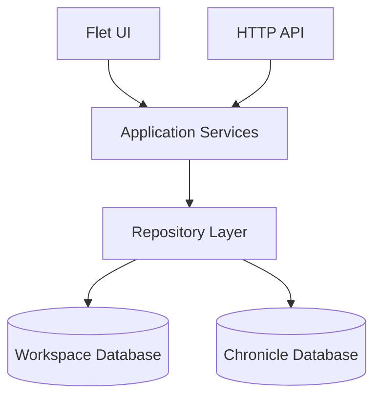
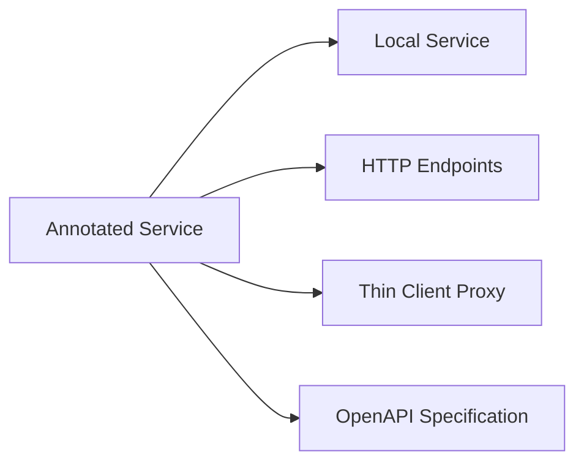
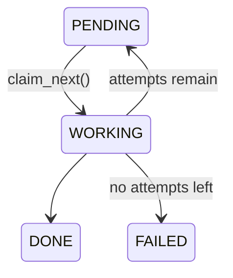
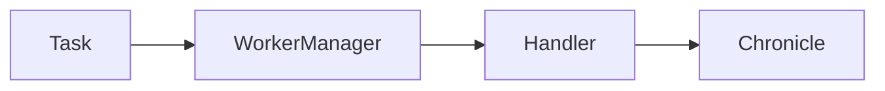

# Architecture

This document describes the architectural principles behind Chronicler.

The goal of the architecture is to keep the application simple to extend while supporting multiple deployment modes without duplicating business logic.

> **Intent vs. implementation.** Chronicler is pre-alpha, and this document describes the
> target architecture. Sections that describe something not yet built are marked
> **Planned**; [TODO.md](TODO.md) is the authoritative list of what actually works today.
> Where current behaviour differs from the design, that is called out inline rather than
> quietly implied.

## Design goals

The architecture is built around a few core principles.

### Single implementation of business logic

Chronicle operations should only be implemented once.

Whether the application runs locally, exposes an HTTP API or connects to a remote server should not affect how the business logic is implemented.

### Local first

A complete Chronicler installation should work without network access.

Remote operation is an alternative deployment mode, not a requirement.

### Portable data

Chronicles should be normal filesystem objects that can be copied, archived, synchronized or shared using existing tools.

Chronicler intentionally avoids introducing custom synchronization or storage formats.

### Extensible processing

Adding new functionality should require as little modification to existing code as possible.

Most new features should be implemented by adding services, task providers or processing steps instead of changing existing infrastructure.

---

# High-level architecture

Application services form the center of the application.

Everything else exists to either invoke those services or persist their data.



The same service implementations are used regardless of deployment mode.

---

# Code map

Where each part of the above actually lives.

| Path | Responsibility |
| ---- | -------------- |
| `chronicler/__main__.py` | Argument parsing and mode dispatch (`desktop`, `server`, `web`) |
| `chronicler/core/config.py` | `Settings` — user configuration, including the persisted deployment mode |
| `chronicler/core/wizard.py` | First-run configuration wizard |
| `chronicler/core/container.py` | DI container; `create_scope()` is what gives each unit of work its own session |
| `chronicler/core/local_container.py` | The registrations every local (non-remote) container shares |
| `chronicler/core/remote.py` | `RemoteContainer` / `RemoteServiceProxy` — the thin client's stand-in for a container |
| `chronicler/core/rpc.py` | `@service` registry, and the FastAPI app generated from it (plus `/upload`) |
| `chronicler/core/models.py` | Pydantic domain models crossing every boundary |
| `chronicler/core/repositories.py` | Repository interfaces |
| `chronicler/core/sqlite/` | SQLite implementations of those interfaces |
| `chronicler/core/database.py`, `project_database.py` | SQLAlchemy schema for the archive and project databases |
| `chronicler/core/database_manager.py` | Engine/session ownership, workspace paths, Alembic migration runs |
| `chronicler/core/services/` | Application services — the business logic |
| `chronicler/core/workers.py` | `WorkerManager` — the claim/execute/retry loop |
| `chronicler/core/worker_wiring.py` | The single TaskType → handler mapping, shared by both entry points |
| `chronicler/core/processing/handlers/` | One module per task type, over a shared `HandlerBase` |
| `chronicler/core/processing/` | Importers, the transcript cleaner, the faster-whisper transcriber, the regex guard |
| `chronicler/core/file_staging.py` | Getting a picked file into the workspace (copy locally, upload remotely) |
| `chronicler/desktop/` | Flet application — `app.py` shell, `state.py` navigation, `views/`, `components/`, `theme.py`, `dialogs.py` |
| `chronicler/server/main.py` | Headless entry point: the generated API plus a worker loop on one event loop |
| `chronicler/webclient/` | Reverse proxy and static frontend for the browser client |
| `chronicler/migrations/` | Two Alembic chains: `archive/` and `project/` |

The test tree under `tests/chronicler/` mirrors this layout module for module.

---

# Deployment modes

Chronicler supports four deployment modes.

The selected mode is determined by the application configuration and the entry point used.

## Full Stack

```text
Flet UI
    │
Application Services
    │
Repositories
    │
Workspace + Chronicle databases
```

Everything executes locally.

---

## Server

```text
HTTP API
    │
Application Services
    │
Repositories
    │
Workspace + Chronicle databases
```

The server is a headless Chronicler instance.

It exposes the same application services through HTTP while managing storage and background processing.

Additionally, it provides a specialized `/upload` endpoint for receiving files (such as audio recordings) from remote clients.

---

## Thin Client

```text
Flet UI
    │
Generated Remote Service Wrappers
    │
HTTP API
    │
Application Services
```

The Thin Client performs no local processing.

All work is delegated to a remote Chronicler server.

---

## Web Client (Server)

```text
Web Browser
    │
Web Client Server
    │
HTTP API
    │
Application Services
```

The Web Client is a browser-based frontend. It is served by a lightweight FastAPI server which also provides configuration for connecting to a Chronicler Server.

---

# Service layer

Application services contain the business logic of Chronicler.

They operate on Chronicles and coordinate persistence, task creation and processing.

Current services include:

## Chronicle Service

Responsible for:

* creating Chronicles
* opening Chronicles
* updating metadata
* managing Chronicle lifecycle

---

## Task Service

Responsible for:

* creating tasks
* updating task state
* querying task progress
* scheduling background work

---

## Transcript Service

Responsible for:

* reading a Chronicle's transcript
* reconciling its speaker count
* listing its audio sources
* rendering plain-text exports

It is the one service that reaches into a Chronicle's own database rather than the
workspace database, so it depends on `DatabaseManager` directly instead of a pre-bound
repository.

---

## Search Service

Responsible for:

* Chronicle metadata search — implemented
* tag and task search — implemented
* full-text search within a Chronicle — **Planned**
* speaker search — **Planned**

The two unimplemented methods raise `NotImplementedError` rather than returning an empty
list, because transcript lines and speakers live in per-Chronicle databases: answering
those queries needs either a workspace-level FTS index or a fan-out across every project
database, not a query against the workspace database. An empty result would be
indistinguishable from "no matches".

Future search implementations may include semantic or vector search.

---

# Generated interfaces

Application services are annotated.

These annotations are used at runtime to generate additional interfaces.



This makes the service definitions the single source of truth.

The Flet application calls services directly when running locally.

When running as a Thin Client, it uses generated proxy implementations that transparently call the remote API.

No application logic is duplicated.

---

# Repository layer

Repositories abstract persistence.

Application services and task handlers use repositories instead of interacting with the databases directly.

The repository layer manages two different storage scopes:

* workspace storage
* Chronicle storage

---

# Storage model

Chronicler intentionally separates application data from Chronicle data.

```text
Workspace/
│
├── chronicler.db          Workspace ("archive") database
│
├── imports/               Shared staging area for picked/uploaded files
│                          (scratch — a worker may consume or overwrite these)
│
└── chronicles/
    ├── <chronicle-uuid>/
    │   ├── project.db     This Chronicle's own database
    │   └── sources/       Durable audio tracks, under their original names
    │
    └── ...
```

Directories are created on demand, so a fresh workspace contains only `chronicler.db`
and `imports/`.

## Workspace database

The workspace database contains application-level information.

Currently:

* the Chronicle index (title, description, kind, status, duration, speaker count, and the
  `project_path` of a linked external Chronicle)
* the task queue
* tags, and which Chronicles carry them

It does **not** contain transcript content.

---

## Chronicle database

Every Chronicle owns its own database, holding the content that makes it large and
worth keeping portable:

* transcript lines
* speakers
* a reserved key/value `metadata` table (created by the baseline migration; nothing
  reads or writes it yet)

Generated analysis will live here too once it exists.

Note that **tags are workspace-level, not per-Chronicle** — they are shared across the
workspace and indexed for search, so they live in `chronicler.db` alongside the
Chronicle index.

Chronicles are otherwise independent projects that can be copied or shared individually.
Each database is migrated by its own Alembic chain (`chronicler/migrations/archive/` and
`chronicler/migrations/project/`), run on the connection that opens it — a Chronicle
copied in from elsewhere is upgraded to head the first time it is opened.

---

# Background processing

Operations that may take significant time are represented as persistent tasks.

Examples include:

* importing files
* recording
* transcription
* post-processing
* exporting

Tasks belong to a Chronicle.

The task payload is stored as JSON, allowing task-specific configuration while keeping the task infrastructure generic.

---

# Task lifecycle

Tasks are persisted in the workspace database, so they survive a restart.



## PENDING

Waiting to be claimed. Also where a failed-but-retryable task returns to.

---

## WORKING

Claimed and executing. Claiming is a single conditional
`UPDATE ... WHERE status='PENDING'` with a rowcount check, so it is atomic — two
processes pointed at one workspace never both run the same task. The claiming worker
stamps `claimed_by` and `claimed_at`.

There is deliberately no separate "claimed but still acquiring resources" state: a
handler that needs to download a model or wait for a GPU does so inside WORKING and
reports progress. Splitting the two would only matter once concurrency limits per
provider exist.

---

## DONE

Execution finished successfully.

---

## FAILED

Execution failed and no attempts remain (`attempts` reached `max_attempts`, default 3).
Each failure is recorded with its error; a task with attempts left goes back to PENDING
instead, and `WorkerManager` bounds each poll cycle to what was pending when the cycle
started so retries spread across cycles rather than burning through instantly.

Failed tasks remain in the queue for inspection.

---

# Workers

Background processing is performed by a `WorkerManager`: a generic loop that claims a
pending task, looks up the handler registered for its type, and executes it. A task type
with no registered handler is failed outright rather than left stuck in WORKING.



Handlers are mapped to task types in one place —
`chronicler/core/worker_wiring.py::build_worker_runtime` — which both the desktop app (in
full-stack mode) and the server call. That is deliberate: a handler registered in only
one entry point is a task type that silently never runs in the other.

The worker loop gets a database session of its own. It and the UI (or HTTP request
handling) are separate coroutines on the same event loop, and an `AsyncSession` is not
safe to share across coroutines whose operations can interleave.

**Planned — Scribes.** The target model names these workers *Scribes* and allows the
number of concurrent Scribes to be configured per provider, so an expensive provider such
as GPU transcription can limit concurrency while cheap ones run many tasks at once. The
current loop is strictly sequential in a single coroutine.

---

# Providers

**Planned.** Providers are the intended extension point: a task type would resolve to one
of several interchangeable implementations, registered by annotation rather than by
hardcoded routing.

| Task type       | Possible providers                         |
| --------------- | ------------------------------------------ |
| Import          | Audio, formatted text                      |
| Recording       | Local recorder                             |
| Transcription   | Faster Whisper                             |
| Post-processing | Cleanup, speaker identification, summaries |
| Export          | Markdown, HTML, PDF                        |

Today there is one handler per task type and no provider concept: `Task` has no
`provider` field, and the implemented types are IMPORT (text), CLEAN and TRANSCRIBE
(faster-whisper). Adding a task type currently means writing a handler module under
`chronicler/core/processing/handlers/` and registering it in `worker_wiring.py`.

---

# Processing pipeline

A Chronicle may pass through several processing stages.

Not every Chronicle requires every stage.

```text
Import
    │
Pre-processing
    │
Transcription
    │
Post-processing
    │
Editing
    │
Export
```

Examples of processing steps include:

Pre-processing:

* audio normalization
* format conversion

Post-processing:

* transcript cleanup
* speaker identification
* summaries

---

# Search

Search is split by which database can answer the question.

## Workspace search

Searches application-level information in the workspace database: Chronicle metadata,
tags, and tasks. Implemented as `LIKE` queries in the SQLite repositories — adequate at
current scale, and the obvious thing to optimize first.

---

## Chronicle search

**Planned.** Searching transcript content within a Chronicle. Nothing implements this yet:
`SQLiteTranscriptRepository.search` and `SearchService.search_chronicle_content` both
raise `NotImplementedError`.

The design problem to settle first is scope. Transcript lines live in per-Chronicle
databases, so "search my whole workspace for a phrase" is either a fan-out across every
`project.db` or a workspace-level index that has to be kept in sync. SQLite FTS5 is the
intended starting point for the single-Chronicle case.

Future implementations may include:

* semantic search
* vector databases
* Elasticsearch

---

# Configuration

Application configuration is stored separately from workspace data.

Configuration includes:

* workspace location
* deployment mode
* remote server configuration
* provider configuration

Provider-specific runtime options may additionally be stored in task payloads.

For example, a summarization task may specify which model to use while the provider itself is configured globally.

---

# Extending Chronicler

Most new functionality follows the same pattern.

1. Add or extend an application service under `chronicler/core/services/`. Decorate the
   class with `@service` if it should be reachable over HTTP, and give every method
   complete type annotations — the generated API and the thin-client proxy both derive
   their (de)serialization from them, so a missing return annotation silently hands
   remote callers a raw dict.
2. If background processing is required, add a `TaskType`, a handler module under
   `chronicler/core/processing/handlers/`, and register it in
   `core/worker_wiring.py::build_worker_runtime`.
3. If the schema changes, generate an Alembic revision in the matching chain
   (`archive` or `project`).
4. Update the user interface if the feature needs to be reachable or configured.
5. Add tests in the mirrored location under `tests/chronicler/`.

Because services are the central abstraction, new functionality automatically becomes available to:

* Full Stack deployments
* Server deployments
* Thin Clients

without requiring duplicate implementations.

---

# Future directions

The current architecture is intended to support future features including:

* additional transcription providers
* AI-assisted processing
* semantic search
* additional client applications
* remote collaboration
* expanded import and export capabilities

The service-oriented architecture allows these features to be added incrementally while preserving compatibility across all deployment modes.
