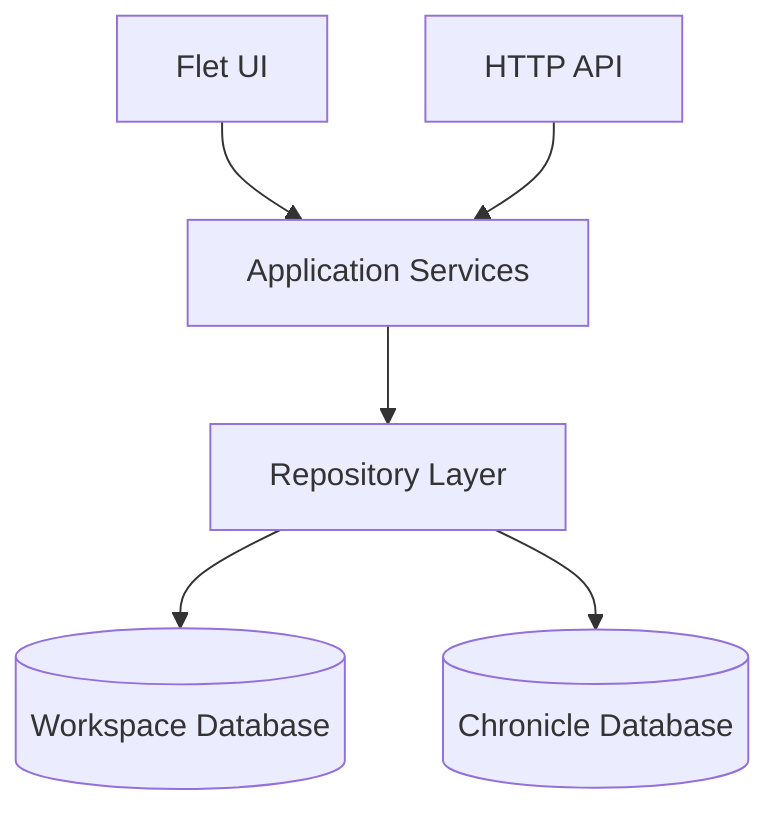
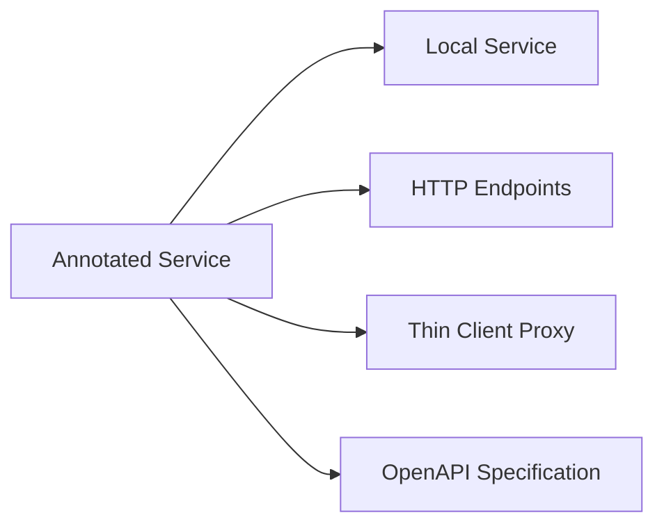
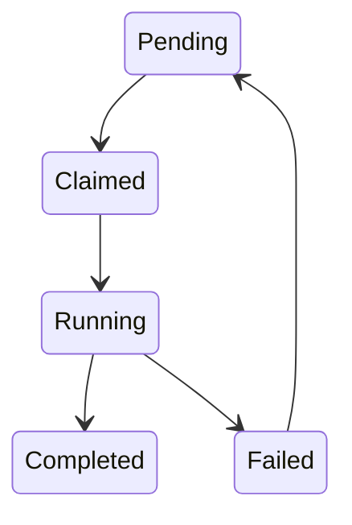
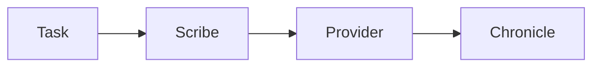

# Architecture

This document describes the architectural principles behind Chronicler.

The goal of the architecture is to keep the application simple to extend while supporting multiple deployment modes without duplicating business logic.

## Design goals

The architecture is built around a few core principles.

### Single implementation of business logic

Chronicle operations should only be implemented once.

Whether the application runs locally, exposes an HTTP API or connects to a remote server should not affect how the business logic is implemented.

### Local first

A complete Chronicler installation should work without network access.

Remote operation is an alternative deployment mode, not a requirement.

### Portable data

Chronicles should be normal filesystem objects that can be copied, archived, synchronized or shared using existing tools.

Chronicler intentionally avoids introducing custom synchronization or storage formats.

### Extensible processing

Adding new functionality should require as little modification to existing code as possible.

Most new features should be implemented by adding services, task providers or processing steps instead of changing existing infrastructure.

---

# High-level architecture

Application services form the center of the application.

Everything else exists to either invoke those services or persist their data.



The same service implementations are used regardless of deployment mode.

---

# Deployment modes

Chronicler supports four deployment modes.

The selected mode is determined by the application configuration and the entry point used.

## Full Stack

```text
Flet UI
    │
Application Services
    │
Repositories
    │
Workspace + Chronicle databases
```

Everything executes locally.

---

## Server

```text
HTTP API
    │
Application Services
    │
Repositories
    │
Workspace + Chronicle databases
```

The server is a headless Chronicler instance.

It exposes the same application services through HTTP while managing storage and background processing.

Additionally, it provides a specialized `/upload` endpoint for receiving files (such as audio recordings) from remote clients.

---

## Thin Client

```text
Flet UI
    │
Generated Remote Service Wrappers
    │
HTTP API
    │
Application Services
```

The Thin Client performs no local processing.

All work is delegated to a remote Chronicler server.

---

## Web Client (Server)

```text
Web Browser
    │
Web Client Server
    │
HTTP API
    │
Application Services
```

The Web Client is a browser-based frontend. It is served by a lightweight FastAPI server which also provides configuration for connecting to a Chronicler Server.

---

# Service layer

Application services contain the business logic of Chronicler.

They operate on Chronicles and coordinate persistence, task creation and processing.

Current services include:

## Chronicle Service

Responsible for:

* creating Chronicles
* opening Chronicles
* updating metadata
* managing Chronicle lifecycle

---

## Task Service

Responsible for:

* creating tasks
* updating task state
* querying task progress
* scheduling background work

---

## Search Service

Responsible for:

* Chronicle metadata search
* full-text search within a Chronicle
* workspace-wide search

Future search implementations may include semantic or vector search.

---

# Generated interfaces

Application services are annotated.

These annotations are used at runtime to generate additional interfaces.



This makes the service definitions the single source of truth.

The Flet application calls services directly when running locally.

When running as a Thin Client, it uses generated proxy implementations that transparently call the remote API.

No application logic is duplicated.

---

# Repository layer

Repositories abstract persistence.

Application services and Scribes use repositories instead of interacting with the databases directly.

The repository layer manages two different storage scopes:

* workspace storage
* Chronicle storage

---

# Storage model

Chronicler intentionally separates application data from Chronicle data.

```text
Workspace
│
├── chronicler.db
│
└── chronicles/
    ├── Chronicle A/
    │   └── project.db
    │
    ├── Chronicle B/
    │   └── project.db
    │
    └── ...
```

## Workspace database

The workspace database contains application-level information.

Examples:

* Chronicle index
* task queue
* workspace state

It does **not** contain transcript content.

---

## Chronicle database

Every Chronicle owns its own database.

Examples of Chronicle data include:

* transcript
* speakers
* metadata
* tags
* generated analysis

Chronicles are therefore independent projects that can be copied or shared individually.

---

# Background processing

Operations that may take significant time are represented as persistent tasks.

Examples include:

* importing files
* recording
* transcription
* post-processing
* exporting

Tasks belong to a Chronicle.

The task payload is stored as JSON, allowing task-specific configuration while keeping the task infrastructure generic.

---

# Task lifecycle

Tasks are persisted in the workspace database.

A typical lifecycle is:



## Pending

Waiting to be executed.

Moving a failed task back to Pending retries the operation.

---

## Claimed

A Scribe has reserved the task but is still acquiring resources.

Examples:

* waiting for GPU availability
* downloading a model
* preparing external resources

---

## Running

The task is actively executing.

---

## Completed

Execution finished successfully.

---

## Failed

Execution failed.

Tasks remain available for inspection and retry.

---

# Scribes

Background processing is performed by **Scribes**.

Scribes are generic workers.

They claim pending tasks, resolve the appropriate provider and execute the requested operation.



The number of concurrent Scribes can be configured independently for each provider.

This allows expensive providers, such as GPU-based transcription, to limit concurrency while lightweight providers may execute many tasks simultaneously.

---

# Providers

Providers implement specific processing functionality.

Examples include:

| Task type       | Possible providers                         |
| --------------- | ------------------------------------------ |
| Import          | Audio, formatted text                      |
| Recording       | Local recorder                             |
| Transcription   | Faster Whisper                             |
| Post-processing | Cleanup, speaker identification, summaries |
| Export          | Markdown, HTML, PDF                        |

Providers are registered using annotations.

This keeps the task system extensible while avoiding hardcoded routing logic.

---

# Processing pipeline

A Chronicle may pass through several processing stages.

Not every Chronicle requires every stage.

```text
Import
    │
Pre-processing
    │
Transcription
    │
Post-processing
    │
Editing
    │
Export
```

Examples of processing steps include:

Pre-processing:

* audio normalization
* format conversion

Post-processing:

* transcript cleanup
* speaker identification
* summaries

---

# Search

Search currently consists of two parts.

## Workspace search

Searches application-level information stored in the workspace database.

Examples include:

* Chronicle metadata
* project names

Some information, such as speakers and tags, is collected from Chronicle databases.

This implementation may be optimized in the future.

---

## Chronicle search

Searches within a single Chronicle.

Current implementation uses SQLite Full-Text Search.

Future implementations may include:

* semantic search
* vector databases
* Elasticsearch

---

# Configuration

Application configuration is stored separately from workspace data.

Configuration includes:

* workspace location
* deployment mode
* remote server configuration
* provider configuration

Provider-specific runtime options may additionally be stored in task payloads.

For example, a summarization task may specify which model to use while the provider itself is configured globally.

---

# Extending Chronicler

Most new functionality follows the same pattern.

1. Add or extend an application service.
2. Add a task type or provider if background processing is required.
3. Register the provider.
4. Update the user interface if configuration is needed.

Because services are the central abstraction, new functionality automatically becomes available to:

* Full Stack deployments
* Server deployments
* Thin Clients

without requiring duplicate implementations.

---

# Future directions

The current architecture is intended to support future features including:

* additional transcription providers
* AI-assisted processing
* semantic search
* additional client applications
* remote collaboration
* expanded import and export capabilities

The service-oriented architecture allows these features to be added incrementally while preserving compatibility across all deployment modes.
