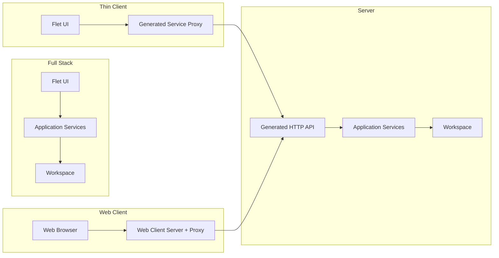

# Chronicler


> Preserve conversations. Discover knowledge.

Chronicler is a local-first transcript management application for importing, generating, processing, editing, searching and exporting transcripts.

A single recorded conversation is called a **Chronicle**.

Chronicler is designed for:

* Work meetings
* Interviews
* Lectures
* D&D campaigns
* Personal recordings
* Any situation where spoken conversations need to become searchable knowledge

A Chronicle is a portable project containing everything related to a conversation, including transcripts, recordings, metadata, exports and future analysis.

## Concepts

### Chronicle

A Chronicle is a self-contained record of a conversation or recording.

Examples include:

* A weekly work meeting
* A D&D session
* An interview
* A lecture

A Chronicle can contain:

* Metadata
* Tags
* Speakers
* Transcript
* Audio recordings
* Generated exports
* AI-generated content and analysis

Every Chronicle is stored independently, making it easy to archive, copy, back up or share without requiring the rest of the workspace.

### Chronicler

Chronicler is the application used to create, manage and process Chronicles.

The application is built around a shared service layer. Whether running locally or remotely, the same application services perform the work.

## Deployment modes

Chronicler supports four deployment modes.

The active mode is determined by the application configuration and the command used to start the application.

### Full Stack

A complete local installation containing:

* Flet user interface
* Application services
* Local storage
* Background processing
* Local AI models

Everything runs on the local machine.

### Server

A headless Chronicler instance providing:

* HTTP API
* Chronicle storage
* Database management
* Background processing
* GPU accelerated processing

The server is a complete Chronicler instance, not only a transcription server.

### Thin Client

A lightweight client containing:

* Flet user interface
* Remote service access

All processing, storage and AI models remain on the server.

### Web Client (Server)

A browser-based client providing access to a remote Chronicler server.

The web client is served by a lightweight web server and communicates with the Chronicler server via its HTTP API.



## Storage

Chronicler separates application configuration from user data.

### Configuration

Application configuration contains machine-specific settings such as:

* Workspace location
* Deployment mode
* Remote server configuration
* API key for authentication
* Provider configuration
* User preferences

Configuration is stored in the operating system's user configuration directory.

Example:

```text
~/.chronicler_config.yaml
```

The configuration determines whether `python -m chronicler` starts a local Full Stack instance or a Thin Client connected to a remote server.

### Automatic Configuration Validation

Chronicler automatically validates your configuration based on the mode you are running. If required settings (like a workspace path for a server or a remote URL for a thin client) are missing, Chronicler will automatically launch the relevant steps of the configuration wizard to help you set it up.

### Workspace

A workspace contains application data together with one or more Chronicles.

```text
ChroniclerWorkspace/
│
├── chronicler.db          Workspace database
│
├── imports/               Staging area for picked or uploaded files
│
└── chronicles/
    ├── <chronicle-id>/
    │   ├── project.db     This Chronicle's own database
    │   └── sources/       Imported audio tracks
    └── ...
```

The workspace database stores application-level information, including:

* Chronicle index
* Task queue
* Tags

Each Chronicle contains its own database and files, holding the content that makes it
large and worth keeping portable:

* Transcript
* Speakers
* Imported audio sources
* Generated content

Tags are shared across the workspace rather than owned by a single Chronicle, so they
live in the workspace database.

### Designed for existing storage solutions

Chronicler intentionally stores data as normal files and directories instead of introducing a custom synchronization or backup mechanism.

This allows users to continue using the tools they already trust.

Examples include:

* Dropbox
* OneDrive
* Nextcloud / ownCloud
* Network shares
* NAS storage
* External drives
* Manual backups

Examples:

* Store an entire workspace inside Dropbox to synchronize between machines.
* Archive a workspace to an external drive.
* Share a single Chronicle with someone else using FTP, Nextcloud or any other file sharing solution.

Because every Chronicle is self-contained, projects can be shared independently without exposing the rest of the workspace.

## Background processing

Long-running operations are represented as persistent tasks.

Tasks belong to a Chronicle, survive application restarts, and are executed by a
background worker loop. They carry a task type and a JSON payload holding
task-specific configuration.

Implemented today:

| Task type    | What it does                                                        |
| ------------ | ------------------------------------------------------------------- |
| `IMPORT`     | Parses a formatted text transcript into a Chronicle                 |
| `TRANSCRIBE` | Transcribes one imported audio track with faster-whisper            |
| `CLEAN`      | Re-runs the transcript cleaner over a Chronicle's existing lines     |

Planned:

| Task type       | Example providers                          |
| --------------- | ------------------------------------------ |
| Recording       | Local recorder                             |
| Pre-processing  | Audio normalization                        |
| Post-processing | Speaker identification, summaries          |
| Export          | Markdown, HTML, PDF                        |
| AI processing   | Summaries, analysis                        |

See [TODO.md](TODO.md) for the current state of each.

## Processing pipeline

A Chronicle can move through several processing stages.

Not every Chronicle requires every stage.

```text
Import
    │
Pre-processing
    │
Transcription
    │
Post-processing
    │
Editing
    │
Export
```

Example workflows:

**Audio**

```text
Audio
    │
Import
    │
Normalize
    │
Transcribe
    │
Speaker identification
    │
Cleanup
    │
Export
```

**Formatted text**

```text
Import
    │
Chronicle
    │
Export
```

## Documentation

The README provides a general overview.

More detailed documentation is available in:

* **[ARCHITECTURE.md](ARCHITECTURE.md)** – service architecture, storage model, task system, deployment modes and extension points.
* **[HOWTO.md](HOWTO.md)** – practical guides for configuring providers, remote servers, GPU support, backups and future integrations.

## Technology stack

| Component  | Technology                    |
| ---------- | ----------------------------- |
| Language   | Python 3.10+                  |
| UI         | Flet                          |
| Database   | SQLite (via aiosqlite)        |
| ORM        | SQLAlchemy 2 (async)          |
| Migrations | Alembic                       |
| Models     | Pydantic 2                    |
| API        | FastAPI                       |
| ASGI       | Uvicorn                       |
| HTTP client| httpx                         |
| Transcription | faster-whisper (optional extra) |
| Build      | Hatchling                     |
| Lint/types | Ruff, mypy                    |
| Tests      | pytest, pytest-asyncio, pytest-cov |
| CI/CD      | GitHub Actions                |

Standalone desktop packaging (PyInstaller or Nuitka) is planned but not set up yet — see
Phase 9 in [TODO.md](TODO.md).

## Development

### Install

```bash
git clone git@github.com:svanschooten/Chronicler.git
```

```bash
python -m venv .venv && source .venv/bin/activate
```

```bash
pip install -e ".[dev]"
```

Optional extras, each absent by default and imported lazily:

| Extra | Provides | Needed for |
| ----- | -------- | ---------- |
| `server` | FastAPI, Uvicorn | Running as a server or web client |
| `transcription` | faster-whisper | `TRANSCRIBE` tasks |
| `normalization` | PyAV | `NORMALIZE` tasks (already present with `transcription`) |
| `llm` | llama-cpp-python | Running a local `.gguf`; not needed for a model server |
| `recording` | sounddevice | Recording a source in the app |

```bash
pip install -e ".[dev,server,transcription,normalization]"
```

The faster-whisper model is downloaded lazily on the first real transcription, not at
startup.

### Run

The startup mode depends on how you launch the application and your configuration.

#### Desktop Application (Full Stack or Thin Client)

```bash
python -m chronicler desktop
```

or simply:

```bash
python -m chronicler
```

* If a local workspace is configured → **Full Stack**
* If a remote server is configured → **Thin Client**

#### Server

```bash
python -m chronicler server
```

The server exposes the generated HTTP API and runs the background worker loop on the
same event loop, so tasks queued by any client are actually executed.

#### Web Client (Server)

```bash
python -m chronicler web
```

or:

```bash
python -m chronicler client:web
```

The web client server hosts the web-based user interface. It requires a configuration that points to a **Chronicler Server** (similar to a Thin Client setup).

### Command Line Options

Chronicler supports several command-line options:

```bash
python -m chronicler [mode] [-v|--verbose] [--config PATH] [--help]
```

- `mode`: The run mode. One of `desktop`, `server`, `web`.
- `-v`, `--verbose`: Enable debug logging (sets log level to DEBUG).
- `--config PATH`: Read *and write* configuration at `PATH` instead of the default
  location. Use it to run an isolated instance, or to keep several workspaces on one
  machine. Equivalent to exporting `CHRONICLER_CONFIG_FILE`.
- `--help`: Show the help message.

### Quality checks

The same three checks CI runs, in the order it runs them:

```bash
ruff check chronicler tests
```

```bash
mypy chronicler tests
```

```bash
pytest --cov=chronicler --cov-report=term --cov-fail-under=80
```

Both `ruff` and `mypy` are blocking gates with no per-module exemptions — if you need to
suppress something, prefer a narrow `# type: ignore[code]` with a comment explaining why
over widening the configuration.

### Test layout

`tests/chronicler/` mirrors the package tree module for module, so the tests for
`chronicler/core/processing/handlers/importing.py` live in
`tests/chronicler/core/processing/handlers/test_importing.py`. The directories are real
packages (`__init__.py`) because the mirrored layout repeats module names.

Shared fixtures:

| Fixture | Defined in | Purpose |
| ------- | ---------- | ------- |
| `async_session` | `tests/conftest.py` | An in-memory workspace database session |
| `mock_flet_app` | `tests/conftest.py` | Autouse; stops anything from opening a real window |
| `attach_page` | `tests/chronicler/desktop/conftest.py` | Gives a Flet control a stand-in `page`, since `Control.page` is a read-only property that raises when unattached |

`tests/paths.py` holds repo-relative paths for fixture files, and
`tests/chronicler/desktop/controls.py` has helpers for asserting against a built Flet
control tree.

Views are tested by building them and inspecting the controls they produced; nothing
renders. Logic worth testing without a page attached is deliberately kept out of the
views — `ImportCoordinator` is the clearest example.

## Future goals

### Near future

* Audio recording
* Transcript editing improvements
* Speaker diarization
* Audio playback synchronization
* Additional import and export formats

### Future

* Additional transcription providers
* AI summaries and analysis
* Semantic search
* Remote collaboration
* Additional client applications
* External integrations

## License

Chronicler is licensed under the terms described in the [LICENSE](LICENSE) file.
