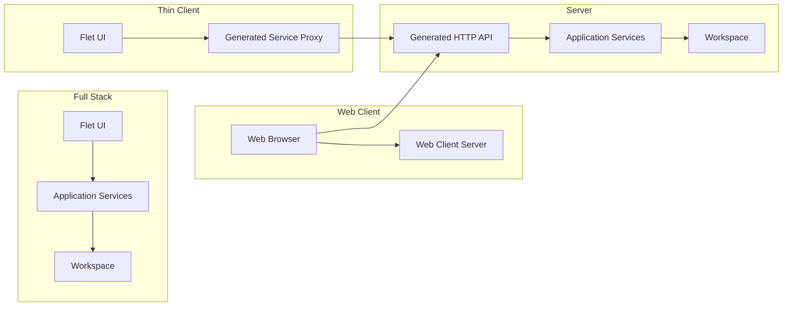

# Chronicler


> Preserve conversations. Discover knowledge.

Chronicler is a local-first transcript management application for importing, generating, processing, editing, searching and exporting transcripts.

A single recorded conversation is called a **Chronicle**.

Chronicler is designed for:

* Work meetings
* Interviews
* Lectures
* D&D campaigns
* Personal recordings
* Any situation where spoken conversations need to become searchable knowledge

A Chronicle is a portable project containing everything related to a conversation, including transcripts, recordings, metadata, exports and future analysis.

## Concepts

### Chronicle

A Chronicle is a self-contained record of a conversation or recording.

Examples include:

* A weekly work meeting
* A D&D session
* An interview
* A lecture

A Chronicle can contain:

* Metadata
* Tags
* Speakers
* Transcript
* Audio recordings
* Generated exports
* AI-generated content and analysis

Every Chronicle is stored independently, making it easy to archive, copy, back up or share without requiring the rest of the workspace.

### Chronicler

Chronicler is the application used to create, manage and process Chronicles.

The application is built around a shared service layer. Whether running locally or remotely, the same application services perform the work.

## Deployment modes

Chronicler supports four deployment modes.

The active mode is determined by the application configuration and the command used to start the application.

### Full Stack

A complete local installation containing:

* Flet user interface
* Application services
* Local storage
* Background processing
* Local AI models

Everything runs on the local machine.

### Server

A headless Chronicler instance providing:

* HTTP API
* Chronicle storage
* Database management
* Background processing
* GPU accelerated processing

The server is a complete Chronicler instance, not only a transcription server.

### Thin Client

A lightweight client containing:

* Flet user interface
* Remote service access

All processing, storage and AI models remain on the server.

### Web Client (Server)

A browser-based client providing access to a remote Chronicler server.

The web client is served by a lightweight web server and communicates with the Chronicler server via its HTTP API.



## Storage

Chronicler separates application configuration from user data.

### Configuration

Application configuration contains machine-specific settings such as:

* Workspace location
* Deployment mode
* Remote server configuration
* API key for authentication
* Provider configuration
* User preferences

Configuration is stored in the operating system's user configuration directory.

Example:

```text
~/.chronicler_config.yaml
```

The configuration determines whether `python -m chronicler` starts a local Full Stack instance or a Thin Client connected to a remote server.

### Automatic Configuration Validation

Chronicler automatically validates your configuration based on the mode you are running. If required settings (like a workspace path for a server or a remote URL for a thin client) are missing, Chronicler will automatically launch the relevant steps of the configuration wizard to help you set it up.

### Workspace

A workspace contains application data together with one or more Chronicles.

```text
Workspace/
│
├── chronicler.db
│
└── chronicles/
    ├── <chronicle-id>/
    │   ├── project.db
    │   ├── audio/
    │   ├── exports/
    │   ├── logs/
    │   └── ...
    └── ...
```

The workspace database stores application-level information, including:

* Chronicle index
* Task queue
* Workspace state

Each Chronicle contains its own database and files, including:

* Transcript
* Speakers
* Tags
* Metadata
* Generated content

### Designed for existing storage solutions

Chronicler intentionally stores data as normal files and directories instead of introducing a custom synchronization or backup mechanism.

This allows users to continue using the tools they already trust.

Examples include:

* Dropbox
* OneDrive
* Nextcloud / ownCloud
* Network shares
* NAS storage
* External drives
* Manual backups

Examples:

* Store an entire workspace inside Dropbox to synchronize between machines.
* Archive a workspace to an external drive.
* Share a single Chronicle with someone else using FTP, Nextcloud or any other file sharing solution.

Because every Chronicle is self-contained, projects can be shared independently without exposing the rest of the workspace.

## Background processing

Long-running operations are represented as persistent tasks.

Tasks survive application restarts and are executed by background workers called **Scribes**.

Examples include:

* Importing files
* Recording audio
* Audio pre-processing
* Transcription
* Transcript cleanup
* Speaker identification
* Exporting
* AI processing

Tasks belong to a Chronicle and contain:

* Task type
* Provider
* JSON payload containing task-specific configuration

Typical task categories include:

| Task type       | Example providers                          |
| --------------- | ------------------------------------------ |
| Import          | Audio files, formatted text                |
| Recording       | Local recorder                             |
| Pre-processing  | Audio normalization                        |
| Transcription   | Faster Whisper                             |
| Post-processing | Cleanup, speaker identification, summaries |
| Export          | Markdown, HTML, PDF                        |

## Processing pipeline

A Chronicle can move through several processing stages.

Not every Chronicle requires every stage.

```text
Import
    │
Pre-processing
    │
Transcription
    │
Post-processing
    │
Editing
    │
Export
```

Example workflows:

**Audio**

```text
Audio
    │
Import
    │
Normalize
    │
Transcribe
    │
Speaker identification
    │
Cleanup
    │
Export
```

**Formatted text**

```text
Import
    │
Chronicle
    │
Export
```

## Documentation

The README provides a general overview.

More detailed documentation is available in:

* **[ARCHITECTURE.md](ARCHITECTURE.md)** – service architecture, storage model, task system, deployment modes and extension points.
* **[HOWTO.md](HOWTO.md)** – practical guides for configuring providers, remote servers, GPU support, backups and future integrations.

## Technology stack

| Component | Technology           |
| --------- | -------------------- |
| Language  | Python               |
| UI        | Flet                 |
| Database  | SQLite               |
| ORM       | SQLAlchemy           |
| API       | FastAPI              |
| ASGI      | Uvicorn              |
| Packaging | PyInstaller / Nuitka |
| CI/CD     | GitHub Actions       |

## Development

### Install

```bash
git clone git@github.com:svanschooten/Chronicler.git

cd Chronicler

python -m venv .venv

pip install -e ".[dev]"
```

### Run

The startup mode depends on how you launch the application and your configuration.

#### Desktop Application (Full Stack or Thin Client)

```bash
python -m chronicler
```

* If a local workspace is configured → **Full Stack**
* If a remote server is configured → **Thin Client**

#### Server

```bash
python -m chronicler server
```

The server exposes the generated HTTP API and executes background Scribes.

A small management CLI is available for inspecting the server.

Examples:

```bash
chronicler server status

chronicler server workers

chronicler server tasks
```

#### Web Client (Server)

```bash
python -m chronicler client:web
```

The web client server hosts the web-based user interface. It requires a configuration that points to a **Chronicler Server** (similar to a Thin Client setup).

## Future goals

### Near future

* Audio recording
* Transcript editing improvements
* Speaker diarization
* Audio playback synchronization
* Additional import and export formats

### Future

* Additional transcription providers
* AI summaries and analysis
* Semantic search
* Remote collaboration
* Additional client applications
* External integrations

## License

Chronicler is licensed under the terms described in the [LICENSE](LICENSE) file.
